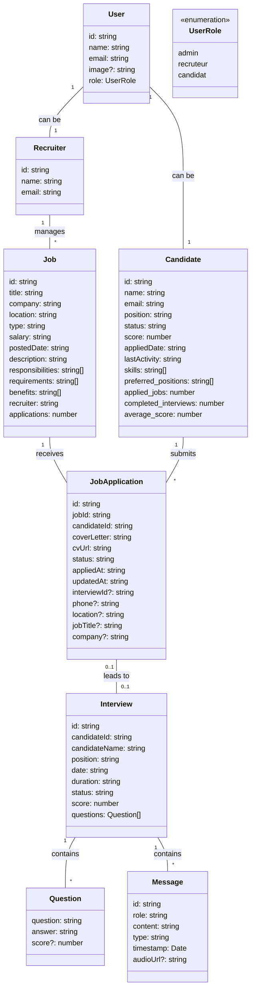

# Recruitment AI Full Platform

A comprehensive recruitment platform with AI-powered features for managing the entire recruitment process, from job posting to candidate interviews.

## Table of Contents

- [Overview](#overview)
- [Features](#features)
- [Entity-Relationship Diagram](#entity-relationship-diagram)
- [Tech Stack](#tech-stack)
- [Getting Started](#getting-started)
  - [Prerequisites](#prerequisites)
  - [Running with Docker](#running-with-docker)
  - [Running without Docker](#running-without-docker)
- [Project Structure](#project-structure)
- [API Documentation](#api-documentation)

## Overview

This platform streamlines the recruitment process by providing tools for recruiters to post jobs, manage applications, and conduct interviews, while allowing candidates to apply for positions and participate in AI-powered interviews.

## Features

- **User Management**: Support for different user roles (admin, recruiter, candidate)
- **Job Posting**: Recruiters can create and manage job listings
- **Application Tracking**: Track and manage candidate applications
- **Interview System**: Schedule and conduct AI-powered interviews
- **Messaging**: Communication between recruiters and candidates
- **Analytics**: Insights into recruitment metrics and candidate performance

## Entity-Relationship Diagram



## Tech Stack

### Backend
- **FastAPI**: High-performance web framework for building APIs
- **SQLAlchemy**: SQL toolkit and ORM
- **PostgreSQL**: Relational database
- **Pydantic**: Data validation and settings management
- **Uvicorn**: ASGI server

### Frontend
- **Next.js**: React framework for production
- **React**: JavaScript library for building user interfaces
- **Tailwind CSS**: Utility-first CSS framework
- **Radix UI**: Unstyled, accessible UI components
- **React Hook Form**: Form validation library
- **Zod**: TypeScript-first schema validation

### Infrastructure
- **Docker**: Containerization
- **Docker Compose**: Multi-container Docker applications

## Getting Started

### Prerequisites

- **Docker and Docker Compose** (for Docker setup)
- **Node.js** (v18 or higher for frontend without Docker)
- **Python** (v3.11 or higher for backend without Docker)
- **PostgreSQL** (for running without Docker)

### Running with Docker

The easiest way to run the application is using Docker Compose:

1. Clone the repository:
   ```bash
   git clone <repository-url>
   cd recruitment-ai-full-platform
   ```

2. Start the application:
   ```bash
   docker-compose up --build
   ```

3. Access the application:
   - Frontend: http://localhost:3000
   - Backend API: http://localhost:8000
   - API Documentation: http://localhost:8000/docs

### Running without Docker

#### Backend Setup

1. Navigate to the backend directory:
   ```bash
   cd backend
   ```

2. Create and activate a virtual environment:
   ```bash
   # On Windows
   python -m venv venv
   .\venv\Scripts\activate

   # On macOS/Linux
   python -m venv venv
   source venv/bin/activate
   ```

3. Install dependencies:
   ```bash
   pip install -r requirements.txt
   ```

4. Set up environment variables (create a .env file in the backend directory):
   ```
   POSTGRES_DB=fastapi_db
   POSTGRES_USER=postgres
   POSTGRES_PASSWORD=postgres
   POSTGRES_HOST=localhost
   POSTGRES_PORT=5432
   ```

5. Run the backend server:
   ```bash
   uvicorn app.main:app --reload --host 0.0.0.0 --port 8000
   ```

#### Frontend Setup

1. Navigate to the frontend directory:
   ```bash
   cd frontend
   ```

2. Install dependencies:
   ```bash
   npm install
   ```

3. Set up environment variables (create a .env.local file in the frontend directory):
   ```
   NEXT_PUBLIC_API_URL=http://localhost:8000
   ```

4. Run the development server:
   ```bash
   npm run dev
   ```

5. Access the frontend at http://localhost:3000

## Project Structure

```
├── backend/
│   ├── app/
│   │   ├── __init__.py
│   │   ├── database.py   # Database connection and session management
│   │   ├── main.py       # FastAPI application and endpoints
│   │   ├── models.py     # SQLAlchemy ORM models
│   │   └── schemas.py    # Pydantic models for request/response validation
│   ├── Dockerfile
│   └── requirements.txt
├── frontend/
│   ├── public/           # Static assets
│   ├── src/
│   │   ├── app/          # Next.js pages and layouts
│   │   ├── components/   # React components
│   │   ├── lib/          # Utility functions and hooks
│   │   └── types/        # TypeScript type definitions
│   ├── Dockerfile
│   └── package.json
└── docker-compose.yml    # Docker Compose configuration
```

## API Documentation

The API documentation is automatically generated using Swagger UI and is available at http://localhost:8000/docs when the backend is running.